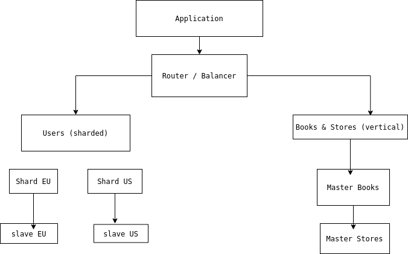

# Домашнее задание к занятию «Репликация и масштабирование. Часть 2»

**Студент:** Лукин Станислав

## Задание 1. Преимущества масштабирования

### Активный master-сервер и пассивный репликационный slave-сервер

- Резервное копирование без остановки master (можно делать бэкап на slave).
- Отказоустойчивость: при сбое master можно быстро переключиться на slave.
- Разделение нагрузки: slave может выполнять часть запросов на чтение.
- Упрощённое обслуживание: проверка миграций и обновлений сначала на slave.

### Master-сервер и несколько slave-серверов

- Горизонтальное масштабирование чтения: запросы SELECT распределяются между несколькими slave.
- Высокая доступность: если один slave выйдет из строя, другие продолжают работу.
- Географическое распределение: можно разместить slave ближе к пользователям.
- Снижение нагрузки на master даже при очень интенсивном чтении.

## Задание 2. План шардинга

### Исходные таблицы

- **users** (user_id, name, email, region, registration_date)
- **books** (book_id, title, author, genre, year)
- **stores** (store_id, name, address, city, phone)

### Вертикальный шардинг

Размещаем каждую таблицу на отдельном сервере:

- **Сервер A** – таблица `users`
- **Сервер B** – таблица `books`
- **Сервер C** – таблица `stores`

Преимущества: независимое масштабирование, разнесение нагрузки, возможность использовать разные типы хранилищ.

### Горизонтальный шардинг

Для таблицы `users` разбиваем данные по полю `region`:

- **Shard EU** – регион EU
- **Shard US** – регион US
- **Shard AS** – остальные регионы

Для каждого шарда настроим master-slave репликацию для отказоустойчивости.

### Режимы работы серверов

- **Серверы горизонтальных шардов** (users) – работают как **master** для своей части данных, принимают запись. Для каждого мастера есть один или несколько **slave** (режим master-slave).
- **Серверы `books` и `stores`** – единственные **master** (можно добавить slave для резервирования).

### Блок-схема (текстовое представление)

\`\`\`
                      +-----------------+
                      |  Application    |
                      +--------+--------+
                               |
                +--------------+--------------+
                |   Router / Balancer         |
                +---+-------------------+-----+
                    |                   |
        +-----------+-----------+       +-------+-------+
        |    Users (sharded)    |       | Books & Stores |
        |                       |       |  (vertical)    |
        |  +------+  +------+   |       |   +------+     |
        |  | Shard|  | Shard|   |       |   |Master|     |
        |  |  EU  |  |  US  |   |       |   |Books |     |
        |  |master|  |master|   |       |   +------+     |
        |  +--+---+  +--+---+   |       |   +------+     |
        |     |         |       |       |   |Master|     |
        |  +--+---+  +--+---+   |       |   |Stores|     |
        |  | slave|  | slave|   |       |   +------+     |
        |  |  EU  |  |  US  |   |       |                |
        |  +------+  +------+   |       |                |
        +-----------------------+       +----------------+
\`\`\`

### Графическая блок-схема

